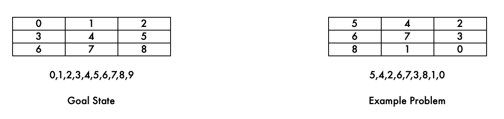
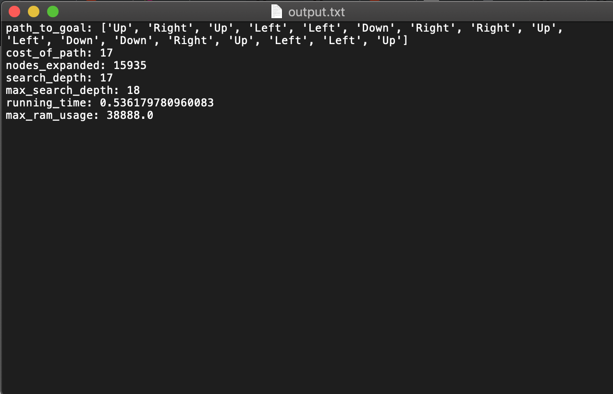
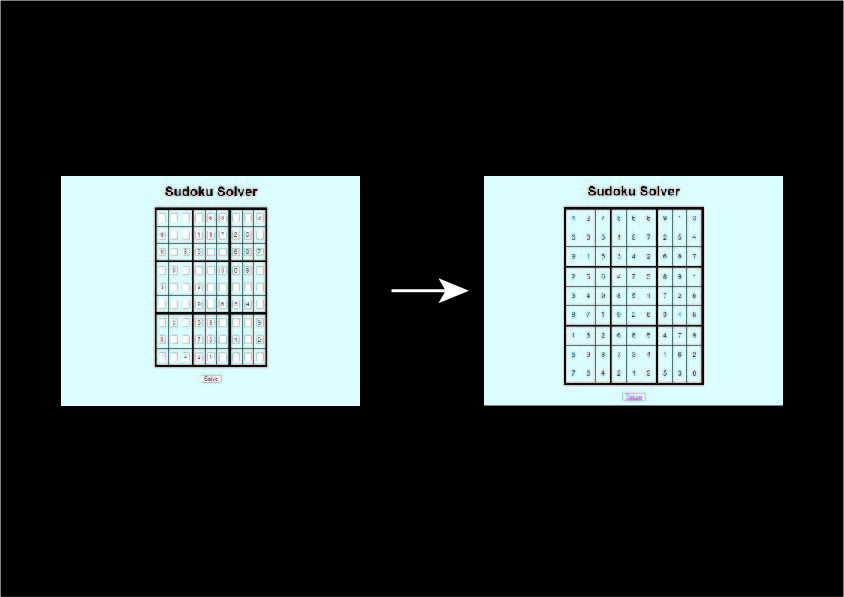

# AI Puzzle Solvers

## <ins>8 Puzzle</ins>

The code uses 3 different search algorithims to solve the 8 puzzle, namely bfs, dfs and A-star search. The manhattan heuristic was used as the heuristic for the A-star search. 

The code intakes a string that represents the board and finds the shortest path based on the search algorithm used.
Below shows the board and equivalent string for a goal state and an example problem state.

The output of the code is a text file which contains the path, nodes expanded, search depth, max search depth, running time and max ram usage. To run this code search method and the board is inputed. An example execution code could be 'python3 puzzle.py bfs 2,8,1,3,5,4,6,0,7'

Below shows an example output file.

## <ins>Sudoku Solver</ins>

The sentence describes a Python web application that uses the Flask framework to host a Sudoku solver. The solver employs two techniques, backtracking and the minimum remaining value heuristic, to solve Sudoku puzzles.

Backtracking is a recursive algorithm that tries to solve a problem by searching for a solution incrementally. It starts with an initial solution, then tries to find a solution to each subproblem by systematically exploring different possibilities. If it reaches a point where it can't find a valid solution, it backtracks to the previous step and tries a different option. This process continues until it finds a valid solution or concludes that none exists.

The minimum remaining value heuristic is a strategy used to choose the next variable to assign a value to. It selects the variable with the fewest possible choices left. This approach can help to reduce the search space and improve the efficiency of the backtracking algorithm.

